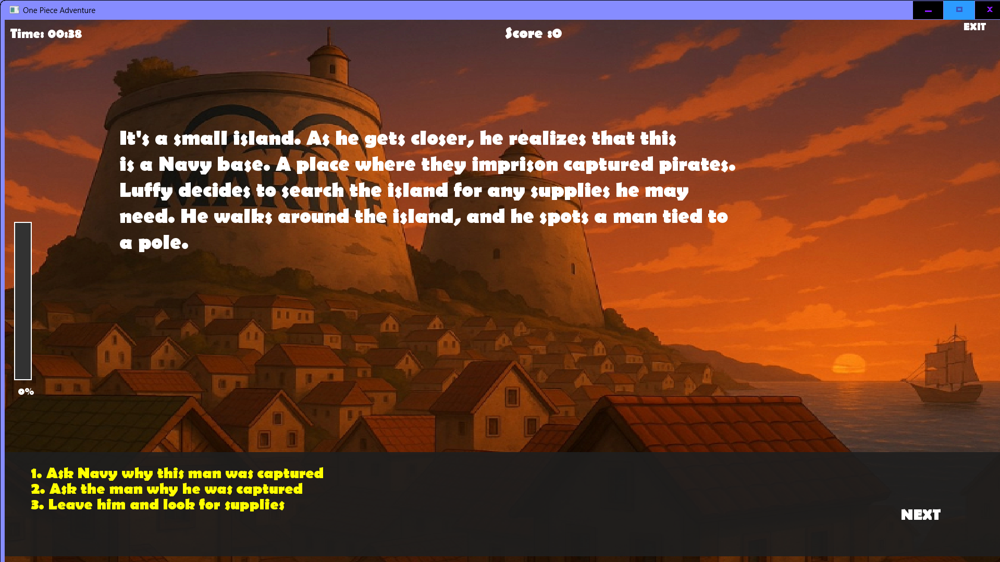

# Treasure of a Thousand Clues
An interactive story game inspired by the *One Piece* Anime, built with C++ and SFML.  
The game allows players to make choices that affect the story outcome, creating a branching narrative experience.

---

## Features
- Choice-based story with multiple paths
- GUI built with SFML
- Typing effect for immersive storytelling
- Background images and character dialogue

---

## Technologies Used
- C++
- SFML (Simple and Fast Multimedia Library)
- Object-Oriented Programming principles

---

## How to Run
1. Clone or download the repository.
2. Open the project in your IDE.
3. Make sure SFML is installed and linked.
4. Compile and run `ProjectOne.cpp`.

---

## Project Context
This project was created as part of my coursework to practice:
- C++ programming
- GUI development with SFML
- Story branching and game design
- Group Members:
  Varushka Dayal
  Luyanda Mhlongo
  Londeka Mswane
  Olwethu Lushozi
  Sithembelo Meyiwa
  Nhlanhla Zama
  Sbongeleni Magudulela
  Xolani Xulu
  Zolile Mzobe

---

## Screenshots & Gameplay

### Main Menu
This is the main menu of the game.  
You can see the **Play** button and the **How to Play** button.  

---

### How to Play Screen
When you click the **How to Play** button, this screen appears, showing detailed instructions on how to navigate the game.  

---

### Intro Screens
After pressing **Play**, this is the first two screens you will encounter. 

---

### Gameplay Example
After the introduction, this is the first scene you will encounter:
  
Players can make choices that affect the story outcome.  
  
  
  

### Level End and Feedback
After each level you will see a "Congratulations" Screen:
  
And you will recieve Feedback after each level:
  
